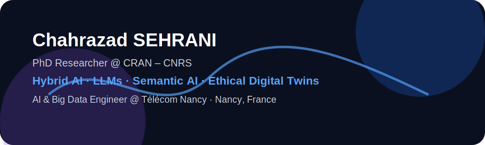

# Chahrazad SEHRANI

<p align="center">
  
</p>

<p align="center">
  
  
  
</p>

## 👋 About me

I am **Chahrazad SEHRANI**, a **PhD Researcher in Artificial Intelligence at CRAN – CNRS / Université de Lorraine**, working on **Ethical Digital Twins for Smart Manufacturing**.

My research focuses on building **ethical reasoning capabilities for Digital Twins** by combining:

- **Large Language Models**
- **Prompt Engineering**
- **Semantic AI**
- **Hybrid AI**
- **Explainable and trustworthy decision-making**
- **Human–robot collaboration**
- **Industry 4.0 / Industry 5.0 systems**

I am also an **AI & Big Data Engineer from Télécom Nancy**, with experience in LLMOps, anomaly detection, generative AI, computer vision, and intelligent industrial systems.

📍 Nancy, Grand Est, France

---

## 🔬 Current Research Focus

### Ethical Digital Twins for Smart Manufacturing

My PhD research explores how autonomous industrial systems can make decisions that are not only technically optimized, but also:

- morally aware,
- explainable,
- transparent,
- auditable,
- human-centered,
- and aligned with ethical principles.

The core idea is to integrate **LLM-based ethical reasoning** into **Digital Twins** for complex manufacturing environments involving humans, robots, production constraints, safety, fatigue, and quality.

```text
Digital Twin + Semantic State Representation + LLM Reasoning + Ethical Policy
                         ↓
              Explainable Decision-Making
                         ↓
        Safer and More Trustworthy Smart Manufacturing
```

---

## 🧠 Research Interests

- Ethical AI
- Digital Twins
- Large Language Models
- Prompt Engineering
- Semantic AI
- Hybrid AI
- LLM-based decision-making
- Explainable AI
- Human–robot collaboration
- Cyber-Physical Systems
- Smart Manufacturing
- Industry 4.0 / Industry 5.0
- AI safety and trustworthiness

---

## 🚀 Featured Projects

| Project | Description | Keywords |
|---|---|---|
| **Ethical Digital Twin Framework** | LLM-driven ethical reasoning framework for smart manufacturing and human–robot collaboration. | LLMs, Digital Twin, Ethics, CPS |
| **LLM-based Anomaly Detection** | Intelligent anomaly detection system for data quality monitoring in large-scale data warehouses. | LLMOps, ML, Data Engineering |
| **Generative AI for Helicopter Visuals** | Fine-tuning and prompting of generative models for realistic helicopter image generation. | Stable Diffusion, FLUX, GANs |
| **Computer Vision for Human–Robot Collaboration** | Detection, segmentation, and tracking of people, robots, and objects using an Intel depth camera. | YOLO, Deep Learning, CV |

More details are available in [`projects/`](./projects).

---

## 🧩 Technical Stack

### AI & Machine Learning
`Python` · `PyTorch` · `Scikit-learn` · `NumPy` · `Pandas` · `Machine Learning` · `Deep Learning` · `Anomaly Detection`

### LLMs & Generative AI
`Large Language Models` · `Prompt Engineering` · `LLMOps` · `RAG` · `Google Gemini` · `Stable Diffusion` · `FLUX` · `GANs`

### Semantic AI & Digital Twins
`Semantic AI` · `JSON-LD` · `Knowledge Representation` · `Digital Twins` · `Cyber-Physical Systems`

### Data Engineering
`ETL` · `SQL` · `Data Preparation` · `Unstructured Data` · `Data Visualization` · `Database Administration`

### Software Engineering
`GitHub` · `Object-Oriented Programming` · `IHM / GUI Development` · `Documentation` · `Research Prototyping`

---

## 💼 Experience

### PhD Researcher in Artificial Intelligence  
**CRAN – CNRS / Université de Lorraine**  
📍 Nancy, France · Oct. 2025 – Present

Research topic: **Digital Ethical Twins for Smart Manufacturing**  
Supervised by **Prof. Hind Bril El Haouzi** and **Prof. Yinling Liu**.

Focus areas:

- LLM-based ethical reasoning
- Hybrid AI for Digital Twins
- Semantic state representation
- Explainable decision-making
- Trustworthy AI for industrial systems
- Human–robot collaboration

---

### Artificial Intelligence Engineer Intern  
**European Investment Bank – EIB**  
📍 Luxembourg · Mar. 2025 – Sept. 2025

Final-year internship focused on developing an intelligent anomaly detection system using:

- Large Language Models
- Machine Learning
- Data Engineering
- LLMOps
- Data quality monitoring
- Large-scale data warehouse analysis

---

### Industrial AI Project  
**Airbus Helicopters**  
📍 Remote / Nancy · Sept. 2024 – Feb. 2025

Developed and fine-tuned generative deep learning models to produce realistic helicopter visuals.

Worked with:

- Stable Diffusion
- FLUX
- GANs
- Prompt Engineering
- Image generation model optimization
- Controlled visual generation

---

### AI Research Engineer Intern  
**CRAN**  
📍 Nancy, France · Jun. 2024 – Jul. 2024

Completed a full AI project for human–robot collaboration involving:

- Data collection
- Preprocessing
- Object detection
- Segmentation
- Tracking
- Intel depth camera
- YOLO-based perception pipeline

---

## 🎓 Education

### PhD in Artificial Intelligence  
**Université de Lorraine**  
Oct. 2025 – Sept. 2028  
Thesis: **Ethical Digital Twins for Smart Manufacturing**

### Engineering Degree in Computer Science  
**Télécom Nancy**  
2022 – 2025  
Specialization: **Artificial Intelligence & Big Data**

### CPGE – Classes préparatoires aux grandes écoles  
2020 – 2022

---

## 📚 Selected Research Directions

I am currently building my research portfolio around the following long-term directions:

1. **Prompt-based ethical reasoning in LLMs**
2. **Hybrid AI architectures combining symbolic and neural reasoning**
3. **Semantic representation of industrial decision contexts**
4. **Digital Twins for trustworthy autonomous systems**
5. **Evaluation protocols for ethical decision-making without obvious ground truth**
6. **Human-centered AI for smart manufacturing**

---

## 🤝 Collaboration

I am open to academic and industrial collaborations on:

- Ethical AI
- LLM reasoning
- Digital Twins
- Smart manufacturing
- Human–robot collaboration
- Semantic AI
- AI for industrial decision support
- Explainable and trustworthy AI

See [`collaboration.md`](./collaboration.md).

---

## 📫 Contact

- Location: Nancy, Grand Est, France
- Affiliation: CRAN – CNRS / Université de Lorraine
- Engineering school: Télécom Nancy
- LinkedIn: `add-your-link-here`
- Google Scholar: `add-your-link-here`
- ORCID: `add-your-link-here`
- Email: `add-your-email-here`

---

<p align="center">
  <b>Hybrid AI · Ethical Digital Twins · LLM Reasoning · Semantic AI · Smart Manufacturing</b>
</p>
